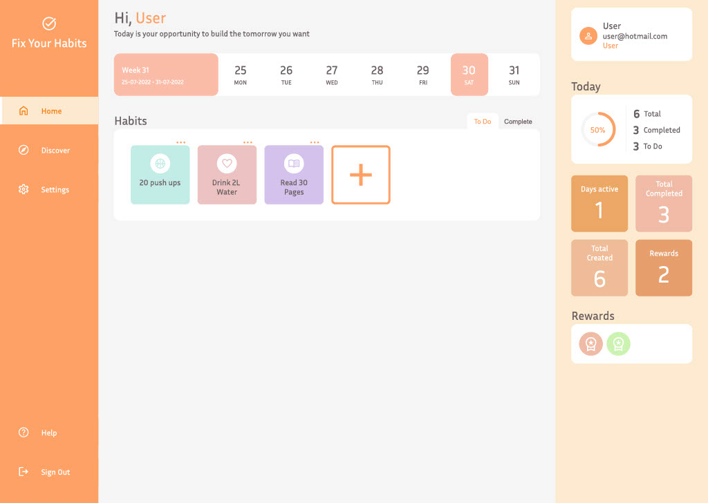

# Fix Your Habits



## Table of contents
* [About the Project](#about-the-project)
* [Getting Started](#getting-started)
    + [Prerequisites](#prerequisites)
    + [Installation](#installation)
* [Data for login](#data-for-login)

## About the Project
Here you can find the Backend for my webapplication Fix Your Habits. It's a habit tracker where you can add, create, edit and delete habits. You can earn rewards for creating habits and discover all kinds of pre-made habits!

Take a look at the <a href="https://github.com/divonne-c/FixYourHabits--BackEnd">Backend</a> code of this project.

## Getting Started
To install this project and use it locally, you need to follow a few steps.

### Prerequisites
* IDE (Created in Webstorm)
* Server/localhost
* npm/Node.js

### Installation

1. Download and Install Webstorm, node.js and npm.

2. Clone the repo with the SSH key in Webstorm.
```
git@github.com:divonne-c/FixYourHabits--FrontEnd.git
```

3. Write the following in the terminal
```
npm install
```
4. To run the webapplication in your browser, write the following in the terminal
```
npm run start
```

5. It’s possible to login and use the web application locally in combination with the <a href="https://github.com/divonne-c/FixYourHabits--BackEnd">backend</a> part of the application.


## Data for login

To test the webapplication, you need to authenticate by signing in or creating an account. Below you will see the dummy accounts to log in. Be aware that the username and password are both lowercase!


| Role          | Username | Password |
|---------------|:--------:|---------:|
| User          |   user   | password |
| Admin         |  admin   | password |


